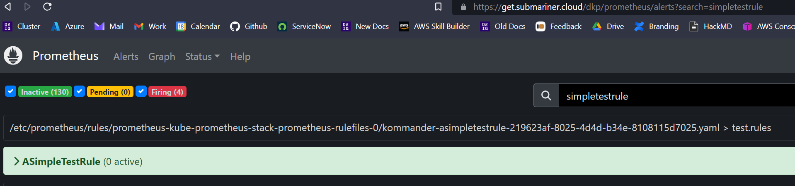
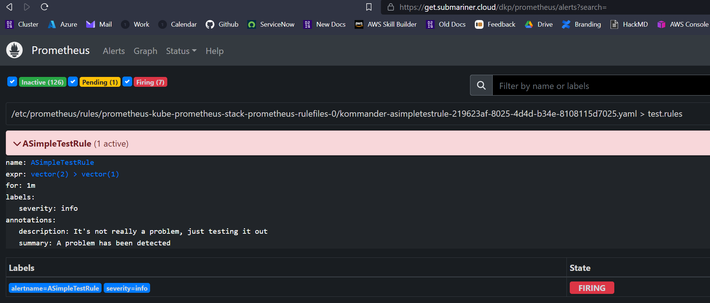

# Enabling SMTP alerting for Prometheus Alerts

1. This repo contains the following example files:

#### test_rule.yaml

    This is a simple, example prometheus rule. The logic of the rule is what triggers the alert. In this example, the expression asserts that 2 is greater than 1, ie. for test purposes it will always trigger. Generate a suitable rule that follows the correct logic for your alert

#### alertmanager.yaml

    This is the override file for your alerting stack. In this example we have defined our SMTP server variables, template directory etc. You have already provided this by email and formatting looks correct

#### notification.tmpl

    The go templating file that sets the parameters for your email, ie, subject and message body for an alert / remediation

2. Apply the "test_rule" manifest:

    ```bash
    kubectl create -f test_rule.yaml
    ```

3. Visit the prometheus dashboard to check that the alert is picked up. Ensure that the correct labels are applied if that's not the case:

    

4. Now we'll update our alertmanager deployment by placing both the alertmanager.yaml and its corresponding template into a secret

    ```yaml
    kubectl create secret generic -n kommander \
    alertmanager-kube-prometheus-stack-alertmanager \
    --from-file=alertmanager.yaml \
    --from-file=notification.tmpl
    ```

5. The prometheus dashboard, by this stage, should show the alert to be firing:

    

6. Delete the alertmanager pod to reload the configuration.

    ```yaml
    kubectl delete po -n kommander alertmanager-kube-prometheus-stack-alertmanager-0
    ```

7. Inspect the alertmanager logs to troubleshoot the smtp side.

    ```yaml
    kubectl logs -f -n kommander alertmanager-kube-prometheus-stack-alertmanager-0
    ```

## Using TLS authentication for your SMTP server

8. Generate a kubernetes secret with your certificates. If this secret already exists then check to ensure that it is empty. Always back up the file to your local machine.

    ```yaml
    kubectl create secret generic -n kommander \
    my-tls-secrets \
    --from-file=ca.crt=path/to/your/ca.crt \
    --from-file=tls.key=path/to/your/tls.key \
    --from-file=tls.crt-path/to/your/tls.crt
    ```

9. Generate and create an overrides file for kube-prometheus-stack. This will generate an override for the helm release. It will mount the secret we just created into the alertmanger pods in a persistent manner.

   ```yaml
   apiVersion: v1
   kind: ConfigMap
   metadata:
   name: alertmanager-overrides
   namespace: kommander
   data:
   values.yaml: |
       ---
       alertmanager:
       alertmanagerSpec:
         secrets:
         - my-tls-secrets
   ```

10. Update the AppDeployment to apply the overrides:

    ```yaml
    dkp edit appdeployment -n kommander kube-prometheus-stack
    ```

    Ensuring that the following field is added to the manifest:

    ```yaml
    spec:
      configOverrides:
        name: kube-prometheus-stack-overrides
    ```


11. Update your alertmanager.yaml to add the following

    ```yaml
        receivers:
        - name: 'email'
          email_configs:
          - to: 'your@email.com'
            tls_ca: /etc/alertmanager/secrets/my-tls-secrets/ca.crt
            tls_cert: /etc/alertmanager/secrets/my-tls-secrets/tls.crt
            tls_key: /etc/alertmanager/secrets/my-tls-secrets/tls.key
    ```

12. Observe the helm-release status. There should shortly be an upgrade

    ```bash
     kubectl describe hr -n kommander kube-prometheus-stack        
    ```

13. Inspect the new pod. If it is not automatically restarted following successful helm release update then delete it. The certificate information should be mounted correctly and available to prometheus for SMTP authentication. The following command will confirm that the secrets are available in the pod:

    ```bash
    kubectl exec -n kommander alertmanager-kube-prometheus-stack-alertmanager-0 -- ls -alh /etc/alertmanager/secrets/my-tls-secrets/
    ```
